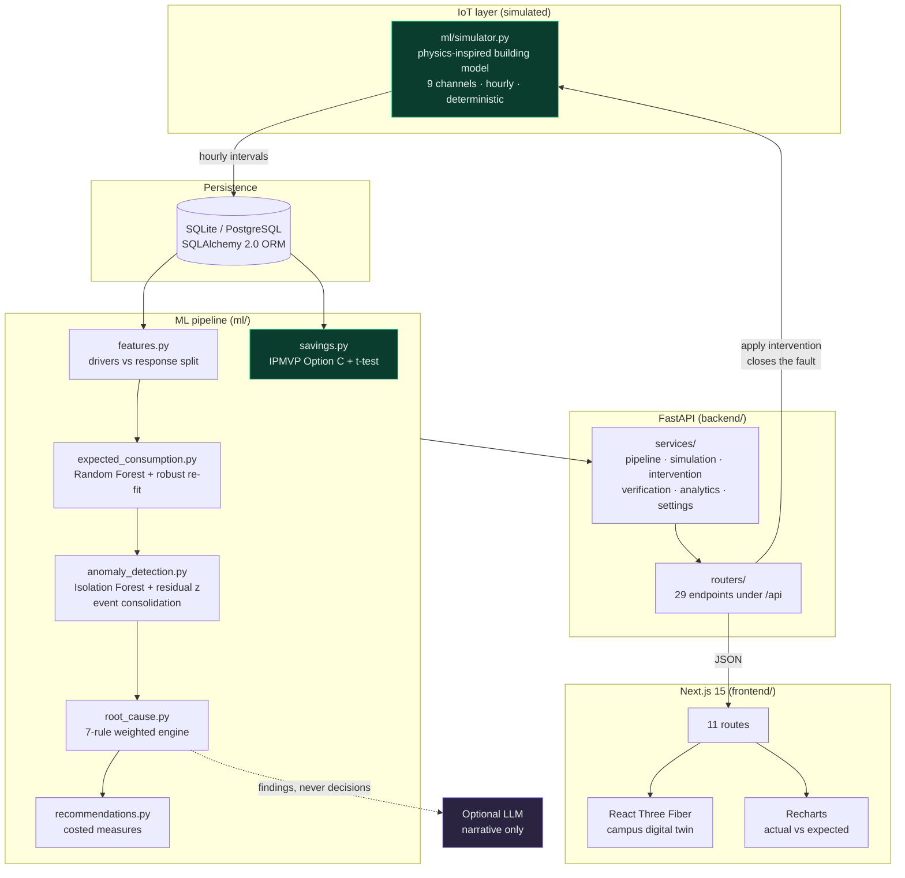
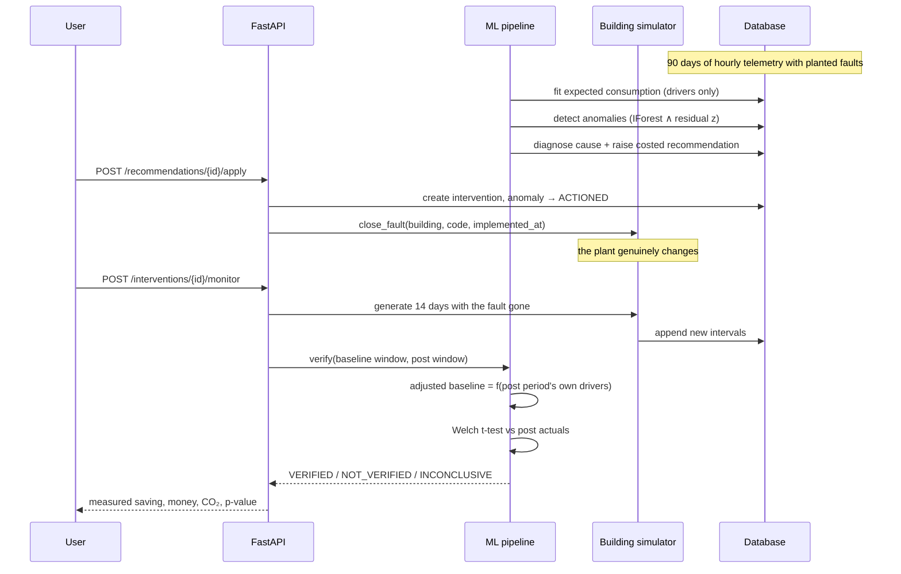
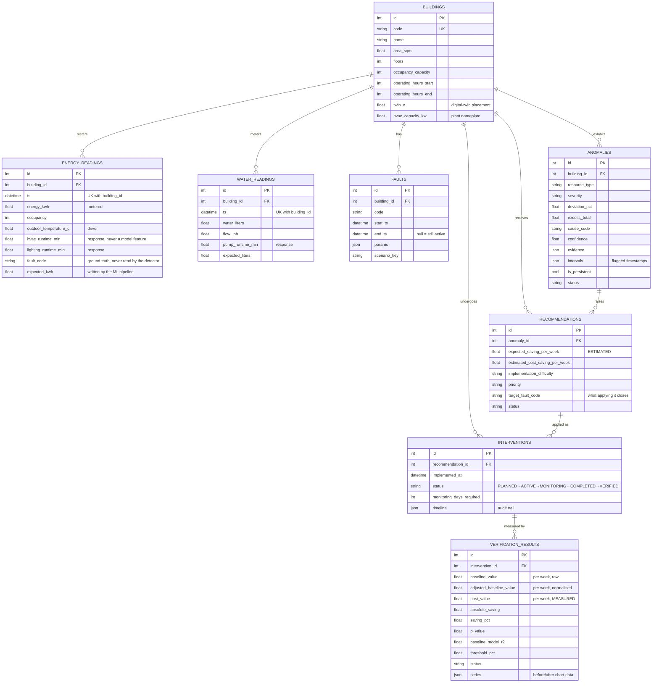
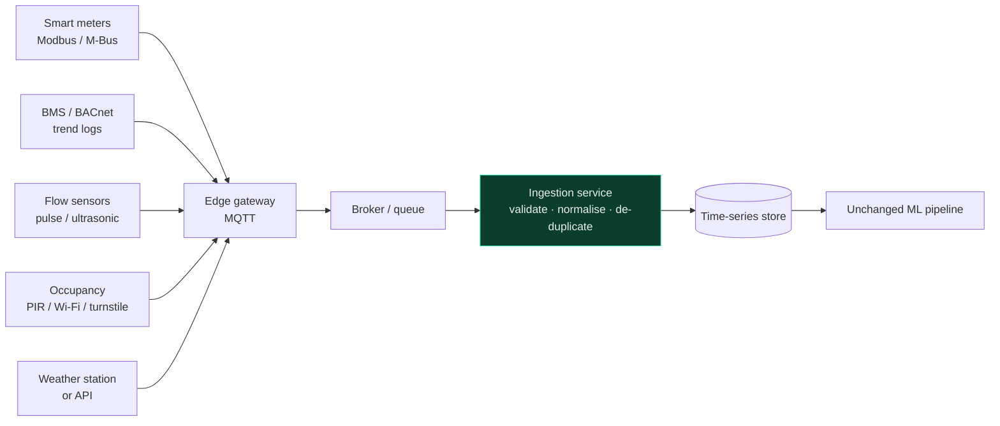

<div align="center">

# EcoTwin

### See Waste. Understand Why. Prove the Savings.

**A sustainable digital twin for building resource waste.**

EcoTwin detects abnormal energy and water consumption across a campus, identifies the
probable cause from measured evidence, recommends an evidence-based intervention, and
then **verifies the saving that intervention actually delivered** against an occupancy-
and weather-adjusted baseline.

`Next.js 15` · `React 19` · `TypeScript` · `Tailwind` · `React Three Fiber` · `Recharts`
`FastAPI` · `SQLAlchemy 2` · `Pydantic v2` · `scikit-learn` · `pandas` · `SciPy`

</div>

---

## Table of contents

1. [Project overview](#1-project-overview)
2. [Problem statement](#2-problem-statement)
3. [Solution](#3-solution)
4. [What makes it different](#4-what-makes-it-different-usp)
5. [Architecture](#5-architecture)
6. [Tech stack](#6-tech-stack)
7. [AI / ML methodology](#7-ai--ml-methodology)
8. [Database schema](#8-database-schema)
9. [API documentation](#9-api-documentation)
10. [Local setup](#10-local-setup)
11. [Running the backend](#11-running-the-backend)
12. [Running the frontend](#12-running-the-frontend)
13. [Dataset generation](#13-dataset-generation)
14. [Demo instructions](#14-demo-instructions)
15. [Future IoT integration](#15-future-iot-integration)
16. [Future scalability](#16-future-scalability)
17. [Limitations](#17-limitations)

---

## 1. Project overview

EcoTwin is a working prototype of a **closed-loop resource intelligence system** for a
five-building university campus. It ingests hourly telemetry, learns what each building
*should* consume, flags what it actually consumes, explains the gap, proposes a fix, and
measures whether the fix worked.

The whole product is built around one sentence:

> **From anomaly detection to verified savings.**

Most building-analytics tools stop at the chart. EcoTwin carries a single finding all the
way to a number a sustainability officer can put in a report and defend under scrutiny.

**Current seeded deployment** (regenerate any time with `python scripts/seed.py`):

| | |
|---|---|
| Buildings | 5 |
| Telemetry | 21,600 hourly intervals (10,800 energy + 10,800 water) over 90 days |
| Channels per interval | 9 (kWh, L, L/h, occupancy, indoor temp, outdoor temp, HVAC / lighting / pump runtime) |
| Anomaly events detected | 5, from 5 planted faults, with **0 false positives** |
| Root-cause accuracy | 5 / 5 |
| Baseline model fit | R² > 0.99, CV(RMSE) 2–5% |
| Interventions verified at seed time | 2 (with real measured savings) |
| Live scenarios awaiting action | 3 |

---

## 2. Problem statement

> **Sustainable Digital Twin for Building Resource Waste** — build an AI-driven digital
> twin that identifies the causes of abnormal energy or water consumption, recommends
> evidence-based interventions, and verifies the actual savings after intervention.

Three specific failures motivate this:

**The meter says *what*, never *why*.** A monthly bill tells a facilities team that
consumption rose. It cannot distinguish a hot week, a busy term, and an air handler that
has been running into an empty building every night since March.

**Waste hides inside normal-looking totals.** A 41 L/hour leak is invisible against a
library drawing 800 L/hour during the day. It is only visible at 03:00, against a
baseline nobody is watching.

**Savings get claimed, not proven.** Efficiency projects are signed off on estimates.
Almost nothing goes back afterwards to measure whether the building actually changed,
adjusted for weather and occupancy.

---

## 3. Solution

EcoTwin implements the full loop as working software:

```
DATA → MONITOR → ANOMALY DETECTION → ROOT-CAUSE ANALYSIS
     → AI RECOMMENDATION → INTERVENTION → POST-INTERVENTION MONITORING
     → SAVINGS VERIFICATION
```

| Stage | What happens | Where |
|---|---|---|
| **Data** | Hourly telemetry per building, 9 channels | `ml/simulator.py`, `backend/app/services/simulation.py` |
| **Monitor** | Random Forest learns expected consumption from demand drivers only | `ml/expected_consumption.py` |
| **Detect** | Isolation Forest **and** hour-normalised robust residual must agree | `ml/anomaly_detection.py` |
| **Diagnose** | Deterministic weighted rule engine over measured evidence | `ml/root_cause.py` |
| **Recommend** | Costed measure sized from the measured excess | `ml/recommendations.py` |
| **Intervene** | Creates the record **and closes the underlying fault** | `backend/app/services/intervention_service.py` |
| **Verify** | IPMVP Option C with routine adjustments + Welch t-test | `ml/savings.py` |

---

## 4. What makes it different (USP)

**1 — Applying an intervention changes the physical model, not a status field.**

This is the single most important design decision in the project. When you click
*Apply Intervention*, EcoTwin closes the underlying fault in the simulated plant from that
timestamp. Every hour of telemetry generated afterwards is produced by the same physics
with the fault gone. The saving that verification then measures is a **genuine consequence
of the action you took**, not a scripted outcome.

**2 — Verification is normalised, and it is allowed to fail.**

A naive before/after comparison is not evidence: if the fortnight after a change happens
to be cooler, consumption falls for reasons that have nothing to do with the measure.
EcoTwin fits a baseline model on the pre-intervention window and evaluates it on the post
period's *own* occupancy and weather to produce an **adjusted baseline**. A saving is
marked `VERIFIED` only when it clears **both** a configurable materiality threshold **and**
statistical significance (Welch t-test). `NOT_VERIFIED` and `INCONCLUSIVE` are real,
reachable outcomes.

> **Try it:** raise *Verification threshold* to 40% in **Settings**, then re-run any
> verification. The same data flips to `NOT_VERIFIED` with an explanation. Nothing is
> hard-coded.

**3 — Equipment runtime is deliberately excluded from the baseline model.**

The expected-consumption model is trained on *demand drivers* (time, occupancy, weather)
and never on *plant response* (HVAC / lighting / pump runtime). If runtime were a feature,
a unit left running all night would simply raise the prediction and the waste would vanish
into the baseline. Keeping it out is what makes "actual vs expected" mean "wasted vs
needed" — and it leaves runtime free to act as **evidence** for the rule engine.

**4 — Residuals are z-scored within each hour of day.**

A 41 L/hour leak is roughly 0.2σ against a building-wide residual spread dominated by
daytime demand. At 03:00 the normal spread is a couple of litres and the same leak is a
20σ event. Per-hour scaling is what lets one detector catch both a daytime HVAC over-run
and an overnight leak.

**5 — Every diagnosis shows its work.**

No black box. Each anomaly carries the exact measurements that produced its diagnosis,
each with the criterion it was tested against and whether it passed. Confidence is the
satisfied share of rule weight, discounted when a competing explanation scores closely and
when the sample is small, and capped below certainty. When nothing fits, the engine returns
`UNEXPLAINED_DEVIATION` and asks for a manual audit rather than inventing a cause.

**6 — The LLM is optional and cannot change a finding.**

EcoTwin runs completely without an API key. If one is configured, the LLM does exactly one
thing: rewrite an already-computed diagnosis into fluent prose. It never decides a cause, a
confidence or a number, every failure path falls back silently, and the UI labels which
text you are reading.

---

## 5. Architecture



### The closed loop



### Repository layout

```
ecotwin/
├── backend/
│   └── app/
│       ├── main.py              FastAPI app, CORS, error handling
│       ├── config.py            every tariff, factor and threshold
│       ├── database.py          engine/session (dialect-agnostic)
│       ├── models.py            10 SQLAlchemy models
│       ├── schemas.py           Pydantic request/response models
│       ├── routers/             11 routers, 29 endpoints
│       └── services/            pipeline, simulation, intervention,
│                                verification, analytics, settings, llm
├── ml/
│   ├── simulator.py             physics-inspired telemetry generator
│   ├── campus.py                5 buildings + the fault plan
│   ├── features.py              driver/response feature split
│   ├── expected_consumption.py  Random Forest + robust re-fit
│   ├── anomaly_detection.py     Isolation Forest + residual + events
│   ├── root_cause.py            7-rule weighted engine
│   ├── recommendations.py       costed measure templates
│   └── savings.py               IPMVP Option C verification
├── frontend/
│   └── src/
│       ├── app/                 11 routes (App Router)
│       ├── components/          twin, charts, cards, layout, ui
│       └── lib/                 API client, types, formatting, hooks
├── scripts/
│   ├── init_db.py               create schema
│   ├── seed.py                  full reset + seed + analyse + verify
│   └── export_dataset.py        dump telemetry to CSV
├── data/                        SQLite database + dataset docs
└── docs/                        methodology and API notes
```

---

## 6. Tech stack

| Layer | Choice | Why |
|---|---|---|
| Frontend | Next.js 15 (App Router), React 19, TypeScript | Routing, code-splitting, strict typing on the API contract |
| Styling | Tailwind CSS 3, CSS custom properties | One token set drives both dark and light themes |
| Components | Radix UI primitives + CVA | Accessible behaviour, styling stays ours |
| Charts | Recharts 3 | Composable enough for actual-vs-expected with anomaly bands |
| 3D | React Three Fiber 9 + drei 10 + three.js | Declarative scene graph that shares React state |
| Icons | Lucide | Consistent 1.5px stroke weight |
| Backend | FastAPI + Pydantic v2 | Typed request/response, automatic OpenAPI |
| ORM | SQLAlchemy 2.0 (typed `Mapped[]`) | Dialect-agnostic; SQLite → PostgreSQL is a URL change |
| ML | scikit-learn, pandas, NumPy, SciPy | Isolation Forest, Random Forest, Welch t-test |
| Database | SQLite (dev), PostgreSQL-ready | Zero-setup demo, production path intact |

---

## 7. AI / ML methodology

### 7.1 Expected consumption — Random Forest with robust re-fit

**Features (drivers only):** `hour_sin`, `hour_cos`, `dow`, `is_weekend`, `is_offhours`,
`occupancy_pct`, `outdoor_temperature_c`, `cooling_degrees`.

**Explicitly excluded:** HVAC runtime, lighting runtime, pump runtime. See
[USP #3](#4-what-makes-it-different-usp).

The training history contains the very faults we want to find. Fitted naively, the forest
would partly learn the waste as normal behaviour. So the fit runs twice:

1. Fit on everything.
2. Score residuals with a median/MAD scale, **within each hour of day**.
3. Drop intervals beyond `trim_z` (default 2.6σ).
4. Re-fit on what remains, never trimming below 55% of the data.

One model per building per resource: 10 models, each trained on ~2,160 intervals.

**Measured fit on the seeded data:** R² 0.992–1.000, CV(RMSE) 1.8–5.4%, trimmed fraction
1–15%. ASHRAE Guideline 14 accepts CV(RMSE) ≤ 30% for hourly baseline models, so these sit
comfortably inside the standard.

### 7.2 Anomaly detection — consensus of two detectors

An interval is flagged only when **all** of the following hold:

| Condition | Default | Reason |
|---|---|---|
| Isolation Forest labels it an outlier | contamination 0.045 | Catches odd *combinations* across the whole feature vector |
| Robust residual z ≥ threshold | 2.5σ | Directional and physically interpretable |
| Deviation ≥ minimum | 12% | Below this is noise, not waste |
| Residual > 0 | — | Under-consumption is not waste |

The Isolation Forest sees the full contextual vector: consumption, occupancy, outdoor
temperature, cyclical time, weekend flag, the baseline residual, its z-score, and the
relevant equipment runtimes.

**Event consolidation.** Raw hourly flags are unusable as a product surface — a three-week
leak would appear as ninety rows. Flags are merged into contiguous runs (gaps ≤ 3h), then
runs that keep recurring within 72h are consolidated into one **persistent** anomaly
spanning the whole episode, retaining the affected intervals so the UI can shade them.

**Severity** comes from mean deviation, escalated when an anomaly is persistent and
long-running: a modest deviation that never goes away is worse than one big spike.

**Measured performance on the seeded dataset:**

| Building | Resource | Planted fault | Detected | Events | False positives |
|---|---|---|---|---|---|
| Administration | Energy | Lighting after hours | ✅ | 1 | 0 |
| Engineering | Energy | HVAC over-run | ✅ | 1 | 0 |
| Computer Science | Energy | UPS parasitic load | ✅ | 1 | 0 |
| Central Library | Water | Distribution leak | ✅ | 1 | 0 |
| Student Center | Water | Pump over-run + overflow | ✅ | 1 | 0 |

**5/5 detected, 0 false positives across 21,600 intervals.**

### 7.3 Root-cause analysis — transparent rule engine

Seven rules, each a list of weighted conditions evaluated against measured context. The
conditions are chosen so the failure modes produce **mutually exclusive signatures**:

| Rule | HVAC runtime | Lighting runtime | Occupancy | Distinguishing evidence |
|---|---|---|---|---|
| HVAC scheduling | **high** | normal | low | temperature inside comfort band |
| Lighting control | normal | **high** | low | off-hours share |
| Water leakage | — | — | low | **night flow**, persistence while empty |
| Pump operation | — | — | low | **pump runtime**, off-hours biased |
| Base-load fault | normal | normal | normal | **flat 24/7 offset** (low hour-spread) |
| Cooling demand | high | normal | normal | outdoor temp **above** normal, indoor at top of band |
| Occupancy driven | proportional | proportional | **high** | inside operating hours |

So the rule that fires is discriminating between real alternatives, not pattern-matching a
single threshold.

```
confidence = satisfied_weight / total_weight
           × margin_factor     (0.80 → 1.00, by how far it beats the runner-up)
           × sample_factor     (0.82 → 1.00, by number of affected intervals)
           capped at 0.94
```

Below `ACCEPT_THRESHOLD` (0.50) the engine returns `UNEXPLAINED_DEVIATION` and recommends a
manual audit. **Diagnosis accuracy on the seeded dataset: 5/5.**

### 7.4 Recommendations — costed from the measured excess

An anomaly is characterised by a span of dates and a set of hours-of-day. The excess is
measured across that whole **fault footprint**, not just the intervals individually flagged:

```
footprint_excess      = Σ max(0, actual − expected) over the span, at the affected hours
expected_weekly_saving = footprint_excess / span_days × 7 × recoverable_fraction
```

`recoverable_fraction` is below 1.0 for every measure and is **stated in the UI** — an HVAC
schedule still needs purge cycles (0.82), a repaired pipe still carries standing flow
(0.93). Deliberately conservative: a fault only *visible* at night is sized from the hours
where it can be measured, so the verified saving usually **exceeds** the estimate.

Money and carbon use the configurable tariffs:

```
energy: saving_kWh × tariff_per_kWh          CO₂: saving_kWh × kgCO₂e/kWh
water:  saving_L / 1000 × tariff_per_kL      CO₂: saving_L / 1000 × kgCO₂e/kL
```

### 7.5 Savings verification — IPMVP Option C

1. Fit a baseline model on the **pre-intervention** window (drivers only).
2. Evaluate it on the **post period's own driver values** → *adjusted baseline*
   (what the building would have used had nothing changed).
3. `saving = adjusted_baseline − actual_post`.
4. Welch t-test on hourly values (one-sided, `alternative="greater"`).

```
VERIFIED         saving_pct ≥ threshold  AND  p < α
INCONCLUSIVE     saving_pct ≥ threshold  AND  p ≥ α
NOT_VERIFIED     saving_pct < threshold
INSUFFICIENT_DATA   fewer than min_post_days of post telemetry
```

The **unadjusted** difference is reported alongside, so the effect of the normalisation is
visible rather than hidden. Only a `VERIFIED` saving is annualised.

---

## 8. Database schema



Two more tables support runtime behaviour: **`app_settings`** (tariff / threshold overrides)
and **`simulation_state`** (the telemetry clock).

**Why `faults` exists.** It is the *simulator's* state, never the detector's. The detection
pipeline never reads it. It exists so that (a) telemetry is reproducible and (b) applying an
intervention can genuinely remove the underlying fault.

---

## 9. API documentation

Interactive docs at **http://127.0.0.1:8000/docs** once the backend is running.

### Health & dashboard
| Method | Endpoint | Purpose |
|---|---|---|
| `GET` | `/api/health` | Liveness + readiness (`seeded`, row counts, data window) |
| `GET` | `/api/dashboard?days=30&resource=ALL` | Everything the command centre renders, one round trip |

### Buildings & telemetry
| Method | Endpoint | Purpose |
|---|---|---|
| `GET` | `/api/buildings?days=30` | All buildings with live state (also powers the twin) |
| `GET` | `/api/buildings/{id}?days=30` | Full detail: series, subsystems, anomalies, interventions |
| `GET` | `/api/energy?building_id=&days=` | Electricity readings with expected consumption |
| `GET` | `/api/water?building_id=&days=` | Water readings with expected consumption |

### The loop
| Method | Endpoint | Purpose |
|---|---|---|
| `GET` | `/api/anomalies` | Filter by `building_id`, `resource`, `severity`, `status` |
| `GET` | `/api/anomalies/{id}` | One anomaly + context + hour-of-day profile |
| `POST` | `/api/anomalies/{id}/analyze` | Re-run root cause (optional LLM narrative) |
| `POST` | `/api/anomalies/detect` | Re-run the whole detection pipeline |
| `GET` | `/api/recommendations` | Filter by `building_id`, `resource`, `status` |
| `POST` | `/api/recommendations/{id}/apply` | **Create intervention + close the fault** |
| `POST` | `/api/recommendations/{id}/dismiss` | Dismiss without acting |
| `GET`/`POST` | `/api/interventions` | List / create |
| `POST` | `/api/interventions/{id}/monitor` | **Collect post telemetry, then verify** |
| `PATCH` | `/api/interventions/{id}/status` | Advance the lifecycle manually |
| `GET` | `/api/verification` | Results, newest first |
| `POST` | `/api/verification/{intervention_id}/run` | Run M&V (accepts `threshold_pct`) |

### Reporting, settings, demo
| Method | Endpoint | Purpose |
|---|---|---|
| `GET` | `/api/reports/summary?days=90` | Campus sustainability report |
| `GET` | `/api/reports/export?format=csv\|json` | Download the full report |
| `GET`/`PUT` | `/api/settings` | Read / update tariffs, factors, thresholds |
| `POST` | `/api/settings/reset` | Back to shipped defaults |
| `GET` | `/api/demo/scenarios` | The 3 scenarios with live loop position |
| `POST` | `/api/demo/reanalyse` | Re-run detection campus-wide |

**Error handling.** `404` for unknown ids with the valid range in the message, `409` for
conflicting state (applying an already-applied recommendation), `422` for validation with
the offending field named, `500` with a diagnostic hint. The frontend distinguishes
*backend unreachable* from *HTTP error* and shows the right remedy for each.

---

## 10. Local setup

### Prerequisites

| | Version | Check |
|---|---|---|
| Python | 3.11+ | `python --version` |
| Node.js | 18+ | `node --version` |

### Install

```bash
# 1. Backend + ML dependencies
pip install -r backend/requirements.txt

# 2. Frontend dependencies
cd frontend && npm install && cd ..

# 3. Create the schema, generate telemetry, run the full pipeline
python scripts/seed.py
```

`scripts/seed.py` takes about 25 seconds and prints what it did at every stage:

```
[1/5] Creating schema
[2/5] Creating buildings              5 buildings
[3/5] Generating telemetry            10,800 hourly intervals per resource
                                      5 faults installed (3 live, 2 remediated)
[4/5] Running the analysis pipeline   5 anomalies detected and diagnosed
[5/5] Applying historically-remediated measures and verifying
      Investigate and clear the continuous parasitic load  VERIFIED  2,824 kWh/wk (17.3%)
      Re-tune the booster pump control                     VERIFIED  9,297 L/wk  ( 9.7%)
```

### Optional configuration

Copy `backend/.env.example` to `.env` at the repo root. Everything has a working default.

```ini
ECOTWIN_DATABASE_URL=sqlite:///./data/ecotwin.db
ECOTWIN_ELECTRICITY_TARIFF=8.50
ECOTWIN_WATER_TARIFF_PER_KL=45.00
ECOTWIN_GRID_EMISSION_FACTOR=0.71
ECOTWIN_VERIFICATION_THRESHOLD_PCT=5.0
# Entirely optional — the product works fully without it
ECOTWIN_LLM_API_KEY=
```

---

## 11. Running the backend

```bash
python -m uvicorn app.main:app --reload --app-dir backend --port 8000
```

- API → http://127.0.0.1:8000
- Interactive docs → http://127.0.0.1:8000/docs
- Health → http://127.0.0.1:8000/api/health

The schema is created automatically on boot if missing. Seeding stays an explicit step, so
nobody is surprised by 90 days of telemetry appearing.

---

## 12. Running the frontend

```bash
cd frontend
npm run dev     # http://localhost:3000
```

Point it at a different backend with `NEXT_PUBLIC_API_URL` in `frontend/.env.local`.

| Route | Purpose |
|---|---|
| `/` | Landing page with a live 3D campus twin |
| `/dashboard` | Sustainability command centre |
| `/digital-twin` | Interactive campus model |
| `/buildings` · `/buildings/[id]` | Portfolio and full building detail |
| `/anomalies` · `/anomalies/[id]` | Anomaly centre; **the whole loop runs on the detail page** |
| `/recommendations` | Costed measures with *Apply Intervention* |
| `/interventions` | Lifecycle tracking + audit timeline |
| `/verification` | Before/after proof with the full M&V maths |
| `/reports` | Sustainability report with CSV / JSON export |
| `/settings` | Tariffs, emission factors, detection and verification thresholds |

Production build: `npm run build && npm start`.

> **Note on React StrictMode.** It is disabled in `next.config.mjs`, and deliberately so.
> React 19 StrictMode double-invokes mount effects; react-three-fiber responds to the
> simulated unmount by disposing the renderer, which force-loses the WebGL context on that
> canvas. The remount cannot acquire a new one and the twin renders blank. This is a known
> react-three-fiber constraint and disabling StrictMode is the standard remedy. The twin
> also handles genuine context loss at runtime by falling back to a readable list.

---

## 13. Dataset generation

The dataset is **synthetic and fully documented** in [`data/README.md`](data/README.md).

> It represents the IoT telemetry a real deployment would receive from smart meters, BMS
> trend logs and flow sensors over MQTT or Modbus. Every column is one a real meter also
> reports.

`ml/simulator.py` models the plant rather than replaying a CSV:

```
base_load + HVAC(runtime × capacity × cooling_need)
          + lighting(runtime × capacity)
          + plug(occupancy)
          + pumping
          + fault contributions
```

**Realistic patterns:** weekday / weekend / holiday calendars, per-archetype occupancy
curves (office, academic, library, social), seasonal + diurnal temperature with a
day-correlated weather front, daylight-driven lighting, scheduled pump windows, and
day-level attendance variation.

**Determinism.** Every stochastic term is drawn from a generator seeded on
`(global_seed, building_id, hour_epoch, channel)`. Re-generating any interval yields the
same value — so appending new hours later is perfectly continuous with history, and the
entire dataset is reproducible from one seed.

```bash
python scripts/seed.py --days 120        # longer history
python scripts/seed.py --keep            # re-run analysis without regenerating
python scripts/export_dataset.py         # dump to data/exports/*.csv
```

### Injected faults

| Building | Fault | Resource | Window | State at seed |
|---|---|---|---|---|
| Engineering | AHUs never return to night setback | Energy | last 26 days | **live** |
| Central Library | Continuous loss on the east riser | Water | last 22 days | **live** |
| Administration | Lighting contactors held on overnight | Energy | last 18 days | **live** |
| Computer Science | UPS stuck in bypass, parasitic draw | Energy | days −74 → −52 | remediated |
| Student Center | Failed float switch, pump + tank overflow | Water | days −62 → −41 | remediated |

The three live faults drive the judge-facing demo. The two remediated ones give the
Verification and Reports pages **real measured savings on first load**.

---

## 14. Demo instructions

### Fastest path (about 3 minutes)

1. Start both services (backend on `:8000`, frontend on `:3000`).
2. Open **http://localhost:3000/dashboard**.
3. Click **Demo** in the top bar.
4. Pick **Engineering Block HVAC over-run**.

You land directly on the anomaly the detector found. Then, working down that single page:

| Step | What you see |
|---|---|
| Diagnosis | `HVAC scheduling inefficiency`, 94% confidence, **6 of 6** evidence conditions met with the actual measured values |
| Evidence | HVAC runtime `52 min/h` vs `21 min/h` normal · occupancy `1.8%` · lighting **normal** (rules out lighting) · indoor temp in band (rules out cooling demand) · 100% off-hours |
| Charts | Metered vs expected with flagged intervals shaded; hour-of-day signature showing the evening spike |
| Recommendation | *Optimise the HVAC operating schedule* — **estimated** 1,151 kWh/wk, ₹9,784/wk, 817 kg CO₂/wk |
| **Apply Intervention** | Creates the intervention **and closes the fault** |
| **Collect 14 days and verify** | Simulator generates 14 days with the fault gone, then M&V runs |
| Result | **VERIFIED — 1,937 kWh/week measured, −11.9%** vs adjusted baseline, p = 0.0011, R² 0.995 |

Note that the **measured** saving exceeds the **estimate**. That is the conservative sizing
working as designed, not a coincidence.

### The other two scenarios

- **Central Library water leakage** — night flow `8.8 → 49.8 L/h`, persisting while the
  building is empty. Only visible at night; verification reveals the daytime loss too.
- **Administration Block lighting** — lighting runtime `51 min/h` against `14 min/h` normal
  at 1% occupancy, with HVAC normal.

### Proving it is measuring, not asserting

1. **Settings** → set *Verification threshold* to **40%** → Save.
2. **Verification** → re-run any verified intervention.
3. It flips to `NOT_VERIFIED` with an explanation naming the shortfall.
4. **Reset to defaults** and re-run — it returns to `VERIFIED`.

Other things worth trying: click any building in the **digital twin**; switch date range
(7/30/90) and resource filter in the top bar; change the electricity tariff in Settings and
watch every financial figure move; export the report as CSV.

### Reset

```bash
python scripts/seed.py      # back to the clean demo state
```

---

## 15. Future IoT integration

The simulator sits behind one seam: `backend/app/services/simulation.py`. Everything
downstream consumes rows from `energy_readings` / `water_readings`, so replacing the source
touches nothing else.



**Real-deployment additions:**

- **Ingestion service** replacing `simulate_range()` — an MQTT subscriber writing the same
  rows. `_rows_to_models()` already defines the contract.
- **Data-quality layer**: meter rollover, stuck sensors, clock drift, gap backfill. The
  pipeline already tolerates missing `expected_*` values without corrupting a headline.
- **Real commissioning**: `close_fault()` becomes a BMS write (BACnet schedule change) or a
  work-order ticket, with verification gated on confirmed completion rather than a click.
- **Sub-metering**: circuit-level and riser-level meters would let root-cause analysis point
  at a panel rather than a subsystem, and would raise diagnosis confidence materially.

---

## 16. Future scalability

**Database.** The layer is already dialect-agnostic — the only SQLite-specific code is one
PRAGMA block guarded by `IS_SQLITE`. Moving to PostgreSQL is a URL change; adding TimescaleDB
gives hypertables and continuous aggregates for the reading tables.

**Read path.** Analytics currently aggregates in pandas for portability. At campus scale
this is tens of thousands of rows and irrelevant; at estate scale, push the grouping into
SQL (`date_trunc` + materialised views) and cache dashboard payloads per window.

**ML.** Models are fitted on demand today. At scale: persist fitted models (joblib) with a
nightly retrain job, version them alongside their training window, and track drift.
Per-building models parallelise trivially.

**Async.** The fast-forward and full-detection endpoints are the only slow calls. These
become background jobs (Celery / RQ / ARQ) with progress streamed over WebSocket.

**Multi-tenancy.** Add an `organisation_id` to every table and a tenant-scoped session.
The building-centric schema needs no restructuring.

**Frontend.** Every page already code-splits; the 3D twin is dynamically imported and kept
off the critical path.

---

## 17. Limitations

Stated plainly, because a prototype that oversells itself is not useful.

**The dataset is synthetic.** It is physics-inspired and carefully calibrated (peak
20–32 W/m², office water ~27 L/person/day, library night flow 7–10 L/h), but it is not a
real building. Real telemetry is messier: dead sensors, clock drift, meter rollover,
retrofits mid-period. Detection thresholds would need re-tuning on real data.

**The simulator is also the ground truth.** Detection and diagnosis never read the `faults`
table, so the 5/5 accuracy is a genuine blind result — but it is accuracy against faults the
same codebase generated. Real validation needs real buildings with confirmed work orders.

**The rule engine covers seven causes.** Real buildings fail in more ways — fouled coils,
economiser faults, simultaneous heating and cooling, tariff-driven load shifting. Unmatched
signatures correctly return `UNEXPLAINED_DEVIATION`, but that is a smaller vocabulary than a
production system needs.

**Verification assumes a clean intervention.** IPMVP Option C attributes the whole
whole-facility change to the measure. If two things change in the same fortnight, the saving
is not separable. Real M&V needs a non-routine-adjustment process and, ideally, sub-metered
retrofit isolation (Option B).

**Demo-mode fast-forward is a convenience, and is labelled as one.** It generates 14 days of
post-intervention telemetry with the fault closed. The M&V maths that follows is identical
to what would run on real meters — but in reality you wait a fortnight, and other things
happen during it.

**Only over-consumption is reported.** Under-consumption can indicate a failed meter or a
dark building; today it is silently ignored rather than raised as a data-quality alert.

**Single-user, no authentication.** No login, roles, or audit identity. An intervention
records an owner string, not an authenticated user.

**The 3D twin is stylised, not architectural.** Footprints, positions and heights come from
stored dimensions, but the geometry is abstract by design — the goal is answering "which
building is wasting resources right now" at a glance, not visual fidelity.

---

<div align="center">

**EcoTwin** — See Waste. Understand Why. Prove the Savings.

</div>
